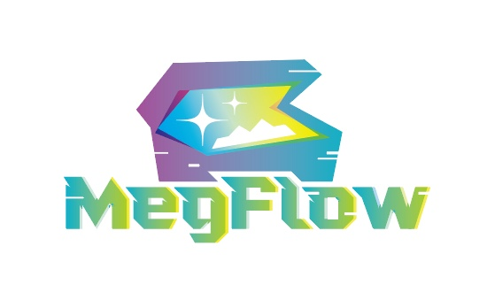

  

## MegFlow

MegFlow 是一个面向视觉应用的流式计算框架, 目标是简单、高性能、帮助机器学习应用快速落地。

## Features
- 基于 [async-std](https://github.com/async-rs/async-std)[features=[tokio1](https://github.com/tokio-rs/tokio)] 的高效异步运行时调度器
- 简洁的基于 [toml](https://toml.io/en/) 的建图描述格式
- 支持静态、动态、共享子图
- 支持 Rust/Python 多语言共存（会 Python 即可）
- 支持资源管理（多层级跨任务共享）
- 支持异常处理（异常任务会终止所在静态图）
- 支持 demux/reorder/transform 等通用函数式组件
- Python 插件内置有栈协程，不依赖 asyncio
- 基础测试工具，支持插件沙盒，用于单测插件

## HowTo
* how to build and run
  * [build with docker](docs/how-to-build-and-run/build-with-docker.zh.md)
  * [build from source](docs/how-to-build-and-run/build-from-source.zh.md)
  * [build on win10](docs/how-to-build-and-run/build-on-win10.zh.md)
  * [generate rtsp](docs/how-to-build-and-run/generate-rtsp.zh.md)
* how to use
  * [add my first service](docs/how-to-add-my-service/01-single-classification-model.zh.md)
  * [how to optimize and debug](docs/how-to-debug.zh.md)
* [how to contribute](docs/how-to-contribute.zh.md)
* [FAQ](docs/FAQ.zh.md)

## Current Support List

| 系统环境 | 支持情况 |
| - | - |
| Windows 10 docker | ✔️ |
| x86 Ubuntu16.04 有 GPU | ✔️ |
| x86 Ubuntu18.04 无 GPU | ✔️ |
| x86 macos | ✔️ |
| ARM | / |

| Python 版本 | 支持情况 |
| - | - |
| 3.6 | ✔️ |
| 3.7 | ✔️ |
| 3.8 | ✔️ |
| 3.9 | / |

## Built-in Applications
* 猫猫围栏
* 电梯电动车报警

## Coming Soon
- 进程级别的节点、子图支持
- 插件自动化测试部署
- 调试工具，建图实时预览 profile 工具
- 性能监控，inspect 工具
- 更多内置应用和组件

## Contact Us
  * Issue: github.com/MegEngine/MegFlow/issues
  * Email: megengine-support@megvii.com
  * QQ Group: 1029741705

## License
- [Apache 2.0](LICENSE)

## Acknowledgement

MegFlow 模型和推理学习了这些项目：
* [MegEngine](https://github.com/megengine/megengine)
* [onnx](https://github.com/onnx/onnx)
* [YOLOX](https://github.com/Megvii-BaseDetection/YOLOX)
* [AlignedReID](https://github.com/huanghoujing/AlignedReID-Re-Production-Pytorch)
* [MEMD](https://github.com/megvii-research/MEMD)

MegFlow Python 使用了下列项目：
* [OpenCV](https://github.com/opencv/opencv)
* [numpy](https://github.com/numpy/numpy)
* [loguru](https://pypi.org/project/loguru/)
* [scipy](https://github.com/scipy/scipy)
* [redis](https://github.com/redis/redis)

MegFlow Rust 使用了以下项目：
* [anyhow](https://github.com/dtolnay/anyhow)
* [async-std](https://github.com/async-rs/async-std)
* [async-channel](https://github.com/smol-rs/async-channel)
* [clap](https://github.com/clap-rs/clap)
* [concurrent-queue](https://github.com/stjepang/concurrent-queue)
* [ctrlc](https://github.com/Detegr/rust-ctrlc.git)
* [ctor](https://github.com/mmastrac/rust-ctor)
* [dyn-clone](https://github.com/dtolnay/dyn-clone)
* [event-listener](https://github.com/stjepang/event-listener)
* [ffmpeg-next](https://github.com/zmwangx/rust-ffmpeg)
* [hyper](https://github.com/bluss/hyper)
* [headers](https://github.com/bluss/headers)
* [image](https://github.com/image-rs/image)
* [indexmap](https://github.com/bluss/indexmap)
* [lazy-static](https://github.com/rust-lang-nursery/lazy-static.rs)
* [mime](https://github.com/hyperium/mime)
* [numpy](https://github.com/rust-numpy/rust-numpy)
* [oneshot](https://github.com/faern/oneshot)
* [proc-macro2](https://github.com/dtolnay/proc-macro2)
* [pretty-env-logger](https://github.com/seanmonstar/pretty-env-logger)
* [pyo3](https://github.com/pyo3/pyo3)
* [quote](https://github.com/dtolnay/quote)
* [rand](https://github.com/rust-random/rand)
* [rweb](https://github.com/kdy1/rweb)
* [serde](https://github.com/serde-rs/serde)
* [serde_json](https://github.com/serde-rs/json)
* [stackful](https://github.com/nbdd0121/stackful)
* [syn](https://github.com/dtolnay/syn)
* [toml](https://github.com/alexcrichton/toml-rs)
* [urlencoding](https://github.com/kornelski/urlencoding)
* [warp](https://github.com/seanmonstar/warp)

