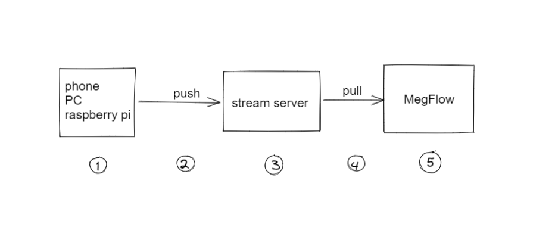

# 创建 rtsp 流地址

## 视频解析概要

1. 前端采集。录制的视频需要用 `ffmpeg` 转到 .ts/.h264/.h265 格式，**不能直接推 .mp4**
2. 推流。`ffmpeg` 命令发数据包给流服务器
3. 流服务器。github 有许多开源实现

    |project|language|优点|缺点|
    |-|-|-|-|
    |[rtsp-simple-server](https://github.com/aler9/rtsp-simple-server) | Golang | 编译部署方便，yaml配置灵活 | 不支持转码 |
    |[livego](https://github.com/gwuhaolin/livego) | Golang |编译部署方便、yaml配置灵活、支持转码 | 文档较少 |
    |[Live555](https://github.com/rgaufman/live555)| C++ | 功能十分强大，作为本地视频流服务器很方便 | 接受外部流需二次开发、文档较少 |
    |[EasyDarwin](https://github.com/EasyDarwin/EasyDarwin)| Golang | 国产开源，功能强大, 具备web管理平台、录像检索回放功能 | 直播业务适合，小项目过于沉重 |

    本文使用 `rtsp-simple-server` 作为样例
4. MegFlow 拉流
5. MegFlow 解码、解析

本文只说明 1～3 如何推流。

## 配置流服务器

下载 [rtsp-simple-server](https://github.com/aler9/rtsp-simple-server/releases/tag/v0.17.2) 并启动

```bash
$ wget https://github.com/aler9/rtsp-simple-server/releases/download/v0.17.2/rtsp-simple-server_v0.17.2_linux_amd64.tar.gz
$ 
$ tar xvf rtsp-simple-server_v0.17.2_linux_amd64.tar.gz && ./rtsp-simple-server 
...
2021/08/19 18:08:00 I [0/0] [RTSP] TCP listener opened on :8554
...
```

## 笔记本推本地视频文件

如果是手机录制的 .mp4，先转成 .ts。移除音频（可选）。
```bash
$ ffmpeg -i  test.mp4 -s 640x480  -q:v 2 -vcodec copy -an  test.ts
```

推 .ts 文件上去
```bash
$ ffmpeg -re -stream_loop -1 -i test.ts -c copy -f rtsp rtsp://127.0.0.1:8554/test
```

## 笔记本推本地摄像头
```bash
ffmpeg -framerate 25 -video_size 640x480 -i /dev/video0 -vcodec h264 -f rtsp rtsp://127.0.0.1:8554/test
```

参数说明
| 选项 | 含义 |
| - | - |
| -framerate | 每秒帧数量（FPS） |
| -video_size | 采集视频宽高 |
| -i | 设备文件描述符 |
| -f | format格式，如 rtsp/flv 等 |
| -q:v | 图像品质，2 表示最好 |
| -an | 移除音频 |
| -vcodec copy | 拷贝流 |

## 树莓派实时推流
1. 参照[官方文档](https://www.raspberrypi.org/documentation/accessories/camera.html)，推流前检查摄像头是否正常运行
   
2. ffmpeg推流
```bash
ffmpeg -framerate 25 -video_size 640x480 -i /dev/video0 -vcodec h264 -f rtsp rtsp://127.0.0.1:8001/test
```

3. 常见问题
  * ffmpeg 进程被 kill： ```Out of memory: killed process: pid```  GPU显存不足导致，树莓派最多支持设置 512M 显存
  * USB camera 推流卡顿、帧率低。应该换树莓派专用 camera

## 检查流地址是否可用

打开 VLC 媒体播放器 - “网络串流”，地址输入“rtsp://127.0.0.1:8554/test”正常播放即可。