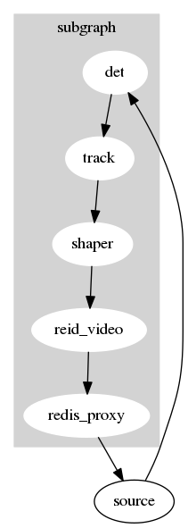

# Config

MegFlow 的建图描述文件使用 [toml](https://toml.io/en/)   格式。toml 注重人类可读性，学习难度约等于 markdown，看完下面 2 个例子大约就会写了。

## 图片范例

举个栗子，`cat_finder/image_gpu.toml`：

```rust
 // 完整的计算图的名字，叫啥都行
main = "cat_finder_image"

[[graphs]]
name = "subgraph"                                                                                               // 子图类型，叫啥都行。子图 == 自己写的业务
inputs = [{ name = "inp", cap = 16, ports = ["det:inp"] }]                      // 子图入口在 det 节点的 inp 端口，队列长度是 16
outputs = [{ name = "out", cap = 16, ports = ["redis_proxy:out"] }] // 子图出口是 redis_proxy 的 out 端口
connections = [                                                                             // 构图， A 的输出，连到 B 的输入
  { cap = 16, ports = ["det:out", "reid:inp"] },                     // det 输出接到 reid 输入
  { cap = 16, ports = ["reid:out", "redis_proxy:inp"] },     // reid 输出送给  redis_proxy
]

    [[graphs.nodes]]                // 子图节点声明。注意 4 个空格，表示和 [[graphs]] 的层次关系
    name = "det"                       // 找 examples/xxx/ 下面的 det.py 或者 det package
    ty = "Detect"                       // 这个 node 执行 Detect class
    model = "yolox-nano"    // 自定义参数，yolox 模型构造需要
    conf = 0.25                          //  yolox 需要的 det 阈值
    nms = 0.45                          // yolox 需要的 nms 阈值
    tsize = 640                          // yolox 需要的 inference size
    path = "models/yolox_nano.pkl" // yolox 模型相对路径
    
    [[graphs.nodes]]            // reid 和 det 同理
    name = "reid"
    ty = "Reid"
    thres = 1300                    // 里面用拉普拉斯计算图像清晰度，阈值写的 1300
    path = "models/aligned_reid.pkl"

    [[graphs.nodes]]           // 纯业务逻辑，name 和 ty 字段是必选，其他看需求
    name = "redis_proxy"
    ty = "RedisProxy"
    ip = "127.0.0.1"         // redis ip 地址
    port = "6379"            // redis port 
    mode = "save"         // 控制此节点存特征进 redis
    prefix = "feature."  // redis key 的前缀，不然整个 redis 库乱乱的

[[graphs]]                      // 描述完整运行的计算图
name = "cat_finder_image"
connections = [
  { cap = 16, ports = ["source:out", "destination:inp"] }, // source 就是 swagger  这类 service，接收视频或图片用的。收到的数据（图像、视频、extra 字段）送进子图
  { cap = 16, ports = ["source:inp", "destination:out"] } // 子图处理完，把结果发给 http server
]

    [[graphs.nodes]]      // http server 的配置
    name = "source"
    ty = "ImageServer" // 这是个图片服务
    port = 8081                // 端口号
    response = "json"  // response Content-Type 用 application/json。不写就是默认  image/jpeg	
    
    [[graphs.nodes]]    // dest 是自己写的业务子图
    name = "destination"
    ty = "subgraph"     // 子图类型。没事儿改它干啥
```

对应可视化的计算图：


## 视频范例

视频和图片的唯一区别：**重资源的节点要在子图之外声明** 。

MegFlow 设计上支持不同视频流跑不同业务。每创建 1 路视频就会创建 1 个子图，40 路视频就是 40 个。det/reid 这种很重的节点自然要被复用。

以`cat_finder/video_gpu.toml`为例：

```rust
main = "cat_finder_video"               // 完整计算图名字

[[nodes]]               // det 节点在子图外声明
name = "det"
ty = "Detect"
model = "yolox-tiny"
conf = 0.25
nms = 0.45
tsize = 640
path = "models/yolox_tiny.pkl"
interval = 5

[[nodes]]               // ReID 节点同样在外部声明，被共享
name = "reid_video"
ty = "ReIDVideo"
path = "models/aligned_reid.pkl"

[[nodes]]             // redis_proxy 使用了连接池，也可以看作“重资源”
name = "redis_proxy"
ty = "RedisProxy"
ip = "127.0.0.1"
port = "6379"
mode = "search"
prefix = "feature."

[[graphs]]
name = "subgraph"
inputs = [{ name = "inp", cap = 16, ports = ["det:inp"] }]
outputs = [{ name = "out", cap = 16, ports = ["redis_proxy:out"] }]
connections = [  // 描述连接关系
  { cap = 16, ports = ["det:out", "track:inp"] },
  { cap = 16, ports = ["track:out", "shaper:inp"] },
  { cap = 16, ports = ["shaper:out", "reid_video:inp"] },
  { cap = 16, ports = ["reid_video:out", "redis_proxy:inp"] },
]

    [[graphs.nodes]]    // 给每个检测目标，赋予唯一的 ID
    name = "track"
    ty = "Track"

    [[graphs.nodes]]    // 业务逻辑：ID 结束后，给个最优结果
    name = "shaper"
    ty = "Shaper"
    mode = "BEST"       // 结果类型，目前只支持 "BEST" 最优


[[graphs]]
name = "cat_finder_video"
connections = [
  { cap = 16, ports = ["source:out", "destination:inp"] },
  { cap = 16, ports = ["source:inp", "destination:out"] }
]

    [[graphs.nodes]]
    name = "source"
    ty = "VideoServer"  // 视频服务
    port = 8082                 // 8081 做注册，8082 做解析
    
    [[graphs.nodes]]
    name = "destination"
    ty = "subgraph"
```

视频解析服务可视化结果和图片接近：



## 完整定义 
TL;DR

严谨的描述文件定义如下：
```rust
// 节点间的连接channel
struct Connection {
    cap: usize,                   // channel容量
    ports: Vec<String>, // 连接的节点端口，格式是`节点名:端口名[:标签]`
}
// 有名channel
struct NamedConn {
    name: String,             // channel的名字
    cap: usize,                  // channel容量
    ports: Vec<String>, // 连接的节点端口，格式是`节点名:端口名[:标签]`
}
// 节点定义
struct Node {
    name: String,         // 节点名
    ty: String,                 // 节点类型
    cloned: usize,        // 表示并行度，默认值为1
    res: Vec<String>,  // 引用的资源名字列表
    ... // 其他参数，会被透传到节点的构造函数中
}
// 资源定义
struct Resource {
    name: String,          // 资源名字
    ty: String,                 // 资源类型
    ... // 其他参数，会被透传到资源的构造函数中
}

struct Graph {
    name: String,                                       // 图的名字
    resources: Vec<Resource>             // 资源声明, 生命周期与该图绑定
    nodes: Vec<Node>,                          // 节点声明，生命周期与该图绑定
    inputs: Vec<NamedConn>,           // 图输入声明
    outputs: Vec<NamedConn>,        // 图输出声明
    connections: Vec<Connection>, // 节点间连接声明
}

struct Config {
    resources: Vec<Resource>            // 全局共享资源, 生命周期与整个应用绑定
    nodes: Vec<Node>,                          // 全局共享节点，生命周期与整个应用绑定
    graphs: Vec<Graph>,                      // 图声明
    main: String,                                      // 主图名字，及应用的进入点
}
```
