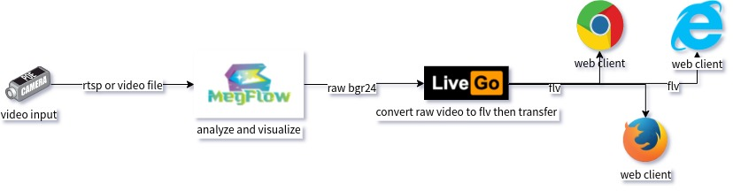
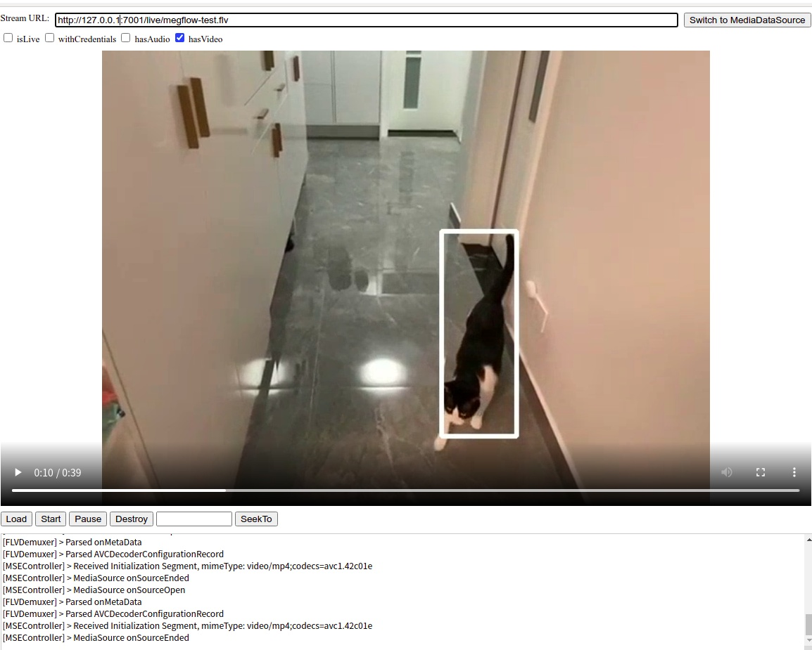

# 视频结果 Web 可视化

## 依赖
依赖 `ffmpeg` 命令，请确保已经安装并能正常运行。

## 部署图



1）video input。可以是 rtsp server 或者视频文件，直接传绝对路径

2）MegFlow。解析视频，把渲染后的结果以 bgr24 格式发给下游

3）[LiveGo](https://github.com/gwuhaolin/livego) 用于把 raw_video 转为 flv 格式。引入 LiveGo 的原因：
* 浏览器无法直接播放 rtsp 流，推荐方案是 HLS 或 http-flv
* 播放端可能不止一个，需要流量转发服务
* 生产环境中存储/点播功能是刚需，MegFlow 不具备此功能，应由其他服务完成

## 操作指南

1）下载启动 LiveGo
```bash
$ wget https://github.com/gwuhaolin/livego/releases/download/0.0.15/livego_0.0.15_linux_amd64.tar.gz && tar xvf livego_0.0.15_linux_amd64.tar.gz && ./livego &
... 
INFO[2021-10-27T15:44:40+08:00] HLS server enable....                        
INFO[2021-10-27T15:44:40+08:00] RTMP Listen On :1935                         
INFO[2021-10-27T15:44:40+08:00] HTTP-API listen On :8090                     
INFO[2021-10-27T15:44:40+08:00] HTTP-FLV listen On :7001                     
...
```

| 端口号 | 说明 |
| --------- | ------ |
| 8090 | 管理端口，创建 room 返回 channel |
| 1935 | 上传端口，用 channel 拼接出上传 url |
| 7001 | 播放端口，用 room 拼接出播放地址 |

2）自测视频推流、播放正常

假设测试视频是 demo.flv（建议长度超过 30 秒），使用 `push_video.py` 推流到 LiveGo
```bash
$ cd ${MegFlow_dir}/flow-python/examples/misc/visualize_client
$ python3 push_video.py
```
浏览器打开 index.html，应能正常播放。

3）运行猫猫围栏可视化配置

猫猫围栏环境设置见 [ cat_finder README](../../flow-python/examples/cat_finder/README.md)。运行起 video 基础版后，能够运行video 可视化版本

```bash
$ cd ${MegFlow_dir}/flow-python/examples
$ run_with_plugins -c cat_finder/video_visualize.toml  -p cat_finder
...
```
浏览器打开 8002 端口，提供 rtsp 地址或视频文件绝对路径，try it out。

打开 index.html，应能播放可视化结果。




4）注意事项和常见问题

**播放地址**

注意 index.html 播放地址不能有多余的 '/'，例如 http://10.199.1.100/:7001/live/megflow-test.flv 是无法播放的。

**视频长度**

测试视频建议超过 30s。至少有 2 个 I 帧，否则影响 flv 转换。

**视频尺寸**

建议测试视频为标准 480p/720p/1080p。

**跨域问题**

web client 修改自 [flv.js](https://github.com/bilibili/flv.js)。如果不用 index.html、直接浏览器打开原始 demo，需自行解决跨域问题。
