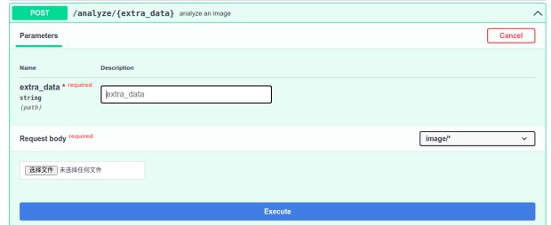
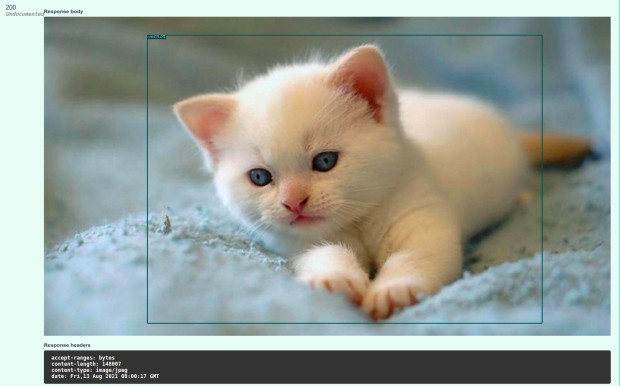
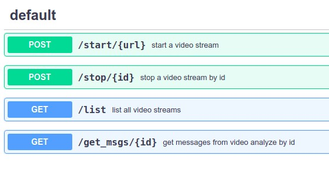

# 猫猫围栏

## 功能概述
注册的猫猫离开围栏，会收到一条告警信息。未注册的不会报警。

## 模型和自测数据下载


| 云盘 | google drive | dropbox |
| - | - | - |
| [链接](https://pan.baidu.com/s/1SoxHZjdWyPRIAwfcHWUQTQ) 提取码: ebcn  | [google](https://drive.google.com/file/d/1EwMJFjNp2kuNglutoleZOVsqccSOW2Z4/view?usp=sharing)  |  [dropbox](https://www.dropbox.com/s/akhkxedyo2ubmys/models.zip?dl=0) |

解压，软链到 examples/models 目录

```bash
$ cd flow-python/examples
$ ln -s ${DOWNLOAD_DIR}/models models
```

如果有 MegFlow-models repo，可以直接

```bash
$ cd MegFlow-models
$ git-lfs update
$ git lfs pull
```

## 软件安装

启动 redis-server
```bash
$ sudo apt install redis-server
$ redis-server
...
756417:M 18 Aug 2021 17:46:14.641 * Ready to accept connections
```

安装 megengine（1.6.0 引入 lite 接口，简化推理并提供模型加密方案）
```bash
$ conda activate py38
$ python3 -m pip install --upgrade pip
$ python3 -m pip install megengine==1.6.0rc1 -f https://megengine.org.cn/whl/mge.html
$ python3
...
>>> import megengine as mge
>>> mge.__version__
'1.6.0'
```

## 图片注册

启动图片服务
```bash
$ cd flow-python/examples
$ pip3 install -r requires.txt
$ cargo run --example run_with_plugins -- -c cat_finder/image_gpu.toml  -p cat_finder    # 有 GPU 的机器执行这个
$ cargo run --example run_with_plugins -- -c cat_finder/image_cpu.toml  -p cat_finder    # 无 GPU 的 laptop 执行这句
```

现在 8081 端口部署了“猫体注册”服务，只需要打开浏览器上传图片、猫咪名称即可。`cat_finder/image_gpu.toml` 详细解释见 [how-to-add-graph](../../../docs/how-to-add-graph.zh.md) 。这里只需要浏览器打开主机所在 8081 端口服务。




测试图片在软链接后的 `models/cat_finder_testdata` 目录。打开浏览器 UI 中选择图片、填写名称，提交即可。成功后
* 用 redis-cli `keys *`可查到对应 BASE64 特征
* 前端展示检测框




## 图片注册 FAQ
如果服务部署在 docker 里、客户端无法直连，这里提供 2 种方法：

1. 运行时容器使用端口映射。例如把内部容器的 8081 映射成外部物理机的 18081、把 8082 映射成 18082
```bash
$ docker run -p 18081:8081 -p 18082:8082  -it ubuntu /bin/bash
```
此时用`docker ps`可以看到 PORTS 映射关系
```bash
$ docker ps
CONTAINER ID   IMAGE     COMMAND       CREATED         STATUS         PORTS                                                                                      NAMES
d4b5b563051e   ubuntu    "/bin/bash"   9 seconds ago   Up 8 seconds   0.0.0.0:18081->8081/tcp, :::18081->8081/tcp, 0.0.0.0:18082->8082/tcp, :::18082->8082/tcp   nostalgic_swartz

```
浏览器打开宿主机的 ip:18081 端口即可使用

2. 在容器内用 `cURL` 发 HTTP POST 请求，不再用 web UI
```bash
$ curl http://127.0.0.1:8081/analyze/my_cat_name  -X POST --header "Content-Type:image/*"   --data-binary @test.jpeg  --output out.jpg
```
`my_cat_name` 是注册的猫咪名称；`test.jpeg` 是测试图片；`output.jpg` 是返回的可视化图片。

## 视频识别

准备一个 rtsp 视频流地址，做测试输入（因不可抗力 MegFlow 无法提供现成地址）。模型包目录提供了测试视频，在 `models/cat_finder_testdata`，需要用户自行部署 live555 服务。最直接的办法：
```bash
$ wget https://github.com/aler9/rtsp-simple-server/releases/download/v0.17.2/rtsp-simple-server_v0.17.2_linux_amd64.tar.gz
$ 
$ tar xvf rtsp-simple-server_v0.17.2_linux_amd64.tar.gz && ./rtsp-simple-server 
$ ffmpeg -re -stream_loop -1 -i ${models}/cat_finder_testdata/test1.ts -c copy -f rtsp rtsp://127.0.0.1:8554/test1.ts
```


* 想用 laptop/树莓派摄像头可搜索 Camera 推流教程
* 也可以手机拍摄视频，再用 ffmpeg 转成 .ts 格式推到 live555 server

相关教程已整合在 [如何生成自己的 rtsp 流地址](../../../docs/how-to-generate-rtsp.zh.md) 。

启动视频识别服务
```bash
$ cd flow-python/examples
$ cargo run --example run_with_plugins -- -c cat_finder/video_gpu.toml  -p cat_finder  # 有 GPU 的机器
$ cargo run --example run_with_plugins -- -c cat_finder/video_cpu.toml  -p cat_finder  # 无 GPU 的设备用这句
```
服务配置文件在`cat_finder/video_gpu.toml`，详细解释见 [how-to-add-graph](../../../docs/how-to-add-graph.zh.md) 。这里只需要打开 8082 端口服务。

```bash
$ google-chrome-stable  http://127.0.0.1:8082/docs 
```



`try it out` 其中的 `/start/{url}` 接口，输入 rtsp 地址（例如“rtsp://127.0.0.1:8554/test1.ts”），会返回 stream_id（例如 0）。

* 服务将打印相关日志

```bash
2021-08-30 15:17:30.361 | DEBUG    | cat_finder.shaper:exec:82 - shaper recv failed_ids [1]
2021-08-30 15:17:31.760 | DEBUG    | warehouse.detection_yolox.lite:inference:157 - YOLOX infer time: 0.4643s
2021-08-30 15:17:34.094 | INFO     | cat_finder.track:exec:27 - stream tracker finish
2021-08-30 15:17:34.094 | INFO     | cat_finder.shaper:exec:47 - stream shaper finish
2021-08-30 15:17:34.201 | DEBUG    | warehouse.reid_alignedreid.lite:inference:57 - ReID infer time: 0.1072s
2021-08-30 15:17:34.203 | INFO     | cat_finder.redis_proxy:search_key:72 - key: b'feature.laohu' dist: 0.7931023836135864
2021-08-30 15:17:34.203 | INFO     | cat_finder.redis_proxy:search_key:72 - key: b'feature.pingai' dist: 0.5928362607955933
```

* 用 stream_id 做 `/get_msgs/{id}` 的入参，可拉取这路流的解析结果
* redis-cli  `keys *` 可看到报警信息
```bash
$ redis-cli 
127.0.0.1:6379> keys *
1) "feature.laohu"
2) "notification.cat_finder"
3) "feature.pingai"
```
用 `brpop notification.cat_finder` 可消费报警消息。


## 视频识别 FAQ
如果服务部署在 docker 里，同样可以把 8082 端口映射到宿主机端口；对应的 `cURL` 命令参考
```bash
$ curl  -X POST  'http://127.0.0.1:8082/start/rtsp%3A%2F%2F127.0.0.1%3A8554%2Ftest1.ts'  # start  rtsp://127.0.0.1:8554/test1.ts
start stream whose id is 2% 
$ curl 'http://127.0.0.1:8082/list'   # list all stream
[{"id":1,"url":"rtsp://10.122.101.175:8554/test1.ts"},{"id":0,"url":"rtsp://10.122.101.175:8554/test1.ts"}]%
```
路径中的 `%2F`、`%3A` 是 [URL](https://www.ietf.org/rfc/rfc1738.txt) 的转义字符

## 模型列表

本服务有以下模型的痕迹

* [YOLOX](https://github.com/Megvii-BaseDetection/YOLOX)， coco 数据集
* Resnet50，imagenet 数据集。最后一层应用 global pooling
* [AlignedReID](https://arxiv.org/abs/1711.08184)，market1501 数据集。推理阶段移除 local 分支

